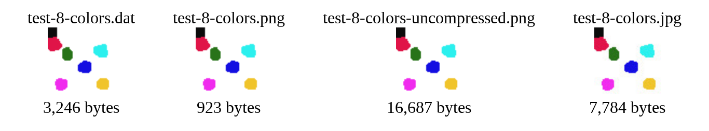

# A failed attempt at a new Image File Format.

I've created this project for fun. It tries to beat the current PNG format by using indexed colors and storing the most used color as a background color (this way I don't need to store the pixels in that color).

## Comparision

As you can see, this image files beats a JPG both in quality as in size (for this type of test, large same color area and indexed colors), but looses to a compacted PNG (generated in GIMP).

## Headers

I started the project defining some headers. Information is delimited by a dot.

### version.width.height.channels.backgroundColor.

The header of the file contains the version of the file, for future compatibility, the width of the image, the height, the number of channels (RGB+A or just RGB) and the background color (the color most used in the image).

## chunks

### colorIndex1,Index2...IndexN.

Each chunk is defined by the color of that chunk followed by the index of each pixel (stored in base 36).

The idea behind this is to have a JSON like format, where the pixels are groupped by color and their position stored as an array (comma separated).

## Try it yourself

Change the variable *fileName* in the *compact.js* file and visit the compact.html to download your new compacted image *.dat*.

Then use change the call to the *load()* function at the end of the *main.js* file, to load *your_image.dat*.
